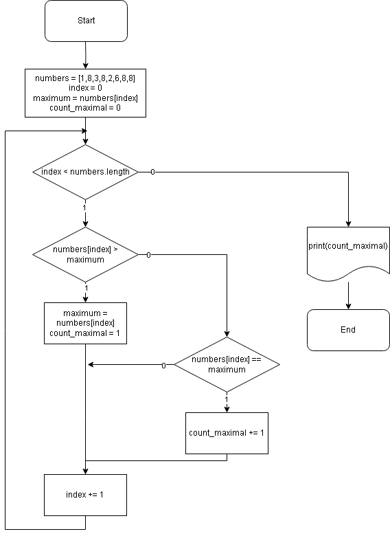

# Инструкция для работы с MD

## Выделение текста

Чтобы выделить текст курсивом, необходимо выделить текст (*) или (_).
*Пример*. _Пример_

Чтобы выделить текст полужирным, необходимов выделить текст (**) или (__).
**Пример**. __Пример__

Два способа для совмещения разных способов выделения текста.

## Списки

Чтобы выделить ненумерованные списки слева добавь *.
Ненумерованные списки выделяем слева (*) или (+)
* элемент 1
* элемент 2
+ Элемент 3

Нумерованный список нумеруется слева (1.)
1. элемент 1
2. элемент 2

## Работа с изображениями

Для того чтобы вставить изображение необходимо добавить

## Ссылки

## Работа с таблицами

## Цитаты

## Заключение